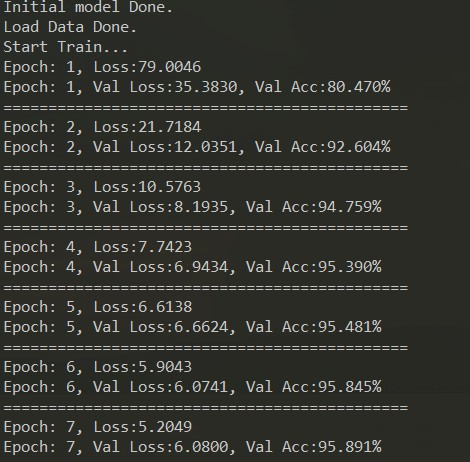
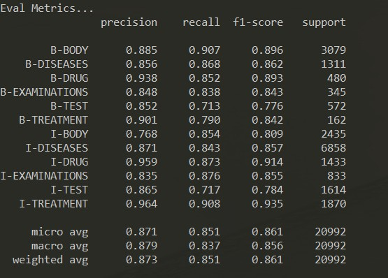
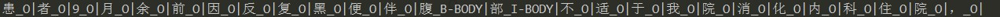

## 运行步骤
1. 进入CCKS_2019_Task1文件夹，运行data_utils.py脚本，将原始数据变为下面的形式
```
术  O
中  O
见  O
盆  O
腹  B-BODY
腔  O
肿  O
物  O
```
```
python data_utils.py
```
2. 训练与评估
```
python main.py
```
- 训练界面如下图:  

- 评估界面如下图:  


3. 预测 
```
python predict.py
```
- 输入句子：患者9月余前因反复黑便伴腹部不适于我院消化内科住院，
- 输出：


## 借鉴项目

https://github.com/XavierWww/Chinese-Medical-Entity-Recognition

https://github.com/lonePatient/BERT-NER-Pytorch

