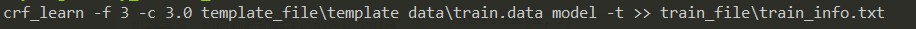
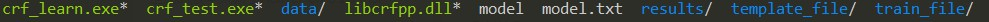
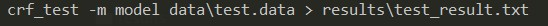
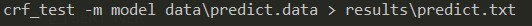

## 简介
#### win10系统下使用CRF++-0.58 进行CRF的命名实体识别  
[CRF++下载地址](http://taku910.github.io/crfpp/#windows)

## 使用

#### 训练:  


- 训练完成后，会生成模型相关文件  


####  预测  
- 带标注的文件  

- 不带标注的文件  


#### Acc评估
```
python util.py
```

## CRF++使用

https://blog.csdn.net/jclian91/article/details/89707257

https://blog.csdn.net/qiqiaiairen/article/details/52636051

https://blog.csdn.net/MARY197011111/article/details/105794983
